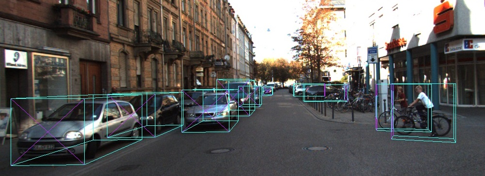

# Predicting 3D Bounding Boxes for Non-temporal Monocular Images



### __Utilising a two stage multi-modal loss model along with rigid body transformations to regress 3D bounding boxes, orientations and coordinates from monocular images__

### File Structure

    .
    ├── Kitti                           # Kitti Data Folder
            ├── camera_cal              # Store global calibration matrix
            ├── results                 # Training and Validation results
            ├── training                # Location of training data 
                    ├── image_2         # Downloaded from KITTI's website 
                    ├── calib           # Downloaded from KITTI's website
                    └── label_2         # Downloaded from KITTI's website
            └── validation              # Location for validation/infference images
                    ├── image_2         # Images you want to perform inferrence/validation on
                    ├── calib           # Corresponding labels
                    └── label_2         # Corresponding labels
    ├── lib                             # python functions and scripts
    ├── weights                         # store trained weights, yolo weights
    ├── yolo                            # yolo network scripts
    ├── Eval.py                         # script to evaluate quantitatively and qualitatively
    ├── Train.py                        # training script 
    ├── Run.py                          # run the model and see the visual examples
    └── Run_with_2D.py                  # run the 2 stage model with yolonet and see the visual examples 


```
python run_with_2D.py

```
This script utilises the a yolo network to detect pedestrians and cars 
from and images. The 2D detections are crop out and fed it into the model so that 
it can predict a 3D bounding box for each of the 2D detections

The script will plot the results of the 3D bounding box onto the image and display it
using cv2.show, press the space bar in order to move on to the next image

Images to be evaluated should be placed in Kitti/validation/image_2 

FLAGS:
--val-img-path
Please specify the path to the images you wish to evaluate. 
Path default is Kitti/validation/image_2/

--calb-path
Please specify the path containing camera calibration obtained from KITTI. 
Path default is Kitti/camera_cal/

--show-2D
Shows yolonet's 2D BoundingBox detections of in a seperate image alongside the 3D regressed boxes


```
python run.py

```

This script utilises the ground truth label's 2D bounding box to 
crop out the the points of interest and feed it into the model so that 
it can predict a 3D bounding box for each of the 2D detections

The script will plot the results of the 3D bounding box onto the image
and display them alongside the groundtruth image and it's 3D bounding box.
This is to help with qualitative assesment. 

Images to be evaluated should be placed in Kitti/validation/image_2 

FLAGS:

--hide-imgs
Hides Display of ground truth and bounding box


```
python Train.py --exp-no 5

```

This script trains the model using cropped images of cars and pedestrians 
obtained from the labels. The model produces 3 outputs the orientation,dimension 
and it's confidence of the 3D bounding box based on the 2D image. 

The script requires you to specifiy an experiment no, so that it can create all the relevant 
folders to track metrics and weights in an ordered fashion.

For each epoch the weights will be saved to the weights folder with the exp_no as the subfolder

For each epoch the training metrics for the orientation loss,dimension loss, theta loss, 
overall interation loss, overall epoch loss is saved to help with debugging and monitor the convergence

ARGUMENTS:

--epochs
type = int 
default = 2 
No of training epochs

--exp-no
type = int
Experiment No. so we can save all the metrics and weights related to this experiment

Eg. python Train.py --exp-no 8


 
 ## To download the YOLO Weights 
Download the weights:
```
cd weights/
./get_weights.sh
```
